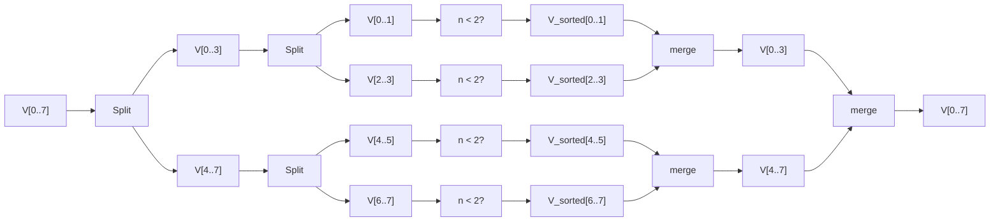

### **1. (Exercício 2.1-3 do livro do Cormen) Escreva um pseudocódigo para a busca linear e mostre, usando invariância de laço,  que o seu algoritmo está correto.**

 Algoritmo simples para a busca linear:

```python
int key;
vector<int> V[MAX] // MAX pode ser qualquer valor inteiro positivo dentro dos limites de memória da máquina
unsigned i(0);
for i=0 até MAX:
    if V[i] == key: // na vdd pode ser qualquer OP com saída booleana envolvendo V[i] e key
        return i;
return -1;
```

As buscas procuram elementos em estruturas de dados. Dado que uma estrutura não foi checada para verificar a existencia dos elementos chave, ela será checada até que o algoritmo de busca termine.
A invariante de laço nesse exemplo é que **sempre, o próximo elemento de V a ser checado, ainda não foi checado desde o passo anterior.** Isso vale para cada elemento de V a ser percorrido, do início ao fim da busca.

### **2. Implemente o algoritmo de ordenação por inserção e crie uma cópia  anotada dele que mede o número de operações no modelo da Random Access  Machine (RAM, seção 2.2 livro do Cormen). **

### **Usando entradas de tamanho  crescente, mostre em um gráfico quando o tempo de execução no modelo RAM diverge de medições feitas em uma máquina real.**

código do insertion_sort

```cpp
void insertion_sort(vector<int>& V) {
        if (V.size() == 1) return;
        int i, j, left;
        for (i=1; i<V.size(); i++) {
                for (j=i; j>0; j--) {
                	    // swap(V[j], V[j - 1])
                        if (V[j-1] > V[j]) {
                                left = V[j - 1];
                                V[j - 1] = V[j];
                                V[j] = left;
                        }
                        else break;
                }
        }
}
```

código anotado

```cpp
void insertion_sort(vector<int>& V) {
        if (V.size() == 1) return;								 // c1 * 1
        int i, j, left;										    // c2 * 1
        for (i=1; i<V.size(); i++) {						     // c3 * n
                for (j=i; j>0; j--) {                              // c4 * sum(1, n-1, ti)
                	    // swap(V[j], V[j - 1])                   
                        if (V[j-1] > V[j]) {                       // c5 * sum(1, n-1, ti)
                                left = V[j - 1];				// c6 * sum(1, n-1, ti - 1)
                                V[j - 1] = V[j];				// c7 * sum(1, n-1, ti - 1)
                                V[j] = left;					// c8 * sum(1, n-1, ti - 1)
                        }
                        else break;								// c9 * sum(1, n-1, 1)
                }
        }
}
```

Análise de _running time_ _(steps)_

$$
\begin{align*}
(I) T(n) = c_1 + c_2 + nc_3 + c_4\sum_{i=1}^{n-1}t_i + c_5\sum_{i=1}^{n-1}t_i + c_6\sum_{i=1}^{n-1}(t_i - 1) + c_7\sum_{i=1}^{n-1}(t_i - 1) + c_8\sum_{i=1}^{n-1}(t_i - 1) + c_9\sum_{i=1}^{n-1}1 \\
\\
(II) T(n)= c_1 + c_2 + nc_3 + (c_4 + c_5)\sum_{i=1}^{n-1}t_i + (c_6 + c_7 + c_8)\sum_{i=1}^{n-1}(t_i - 1) + c_9(n - 1)
\end{align*}
$$


Análise para Melhor caso:
$$
\begin{align*}
t_i = 1\\
T(n)= c_1 + c_2 + nc_3 + (c_4 + c_5)\sum_{i=1}^{n-1}1 + (c_6 + c_7 + c_8)\sum_{i=1}^{n-1}(1 - 1) + c_9(n - 1)\\
T(n)= c_1 + c_2 + nc_3 + (c_4 + c_5)(n - 1) + c_9(n - 1) \\
T(n) = c_1 + c_2 + nc_3 + nc_4 - c_4 + nc_5 - c_5 + nc_9 - c_9\\
T(n) = n(c_3 + c_4 + c_5 + c_9) + c_{22}\\
c_{22} = c_1 + c_2 - c_4 - c_5 - c_9\\
T(n) \approx{O(n)}
\end{align*}
$$
Análise para o Pior caso:
$$
t_i = i\\
\sum_{i=1}^{n-1}i = \frac{(n-1)n}{2} = \frac{n^2 - n}{2}\\
\sum_{i=1}^{n-1}(i - 1) = \sum_{i=1}^{n-1}i - \sum_{i=1}^{n-1}1 = \frac{(n-1)n}{2} - (n - 1) = \frac{n^2 - 3n + 2}{2}\\
\\
T(n) = c_1 + c_2 + nc_3 + (c_4 + c_5)\sum_{i=1}^{n-1}i + (c_6 + c_7 + c_8)\sum_{i=1}^{n-1}(i - 1) + c_9(n - 1)\\
T(n) = c_1 + c_2 + nc_3 + (c_4 + c_5)\frac{n^2 - n}{2} + (c_6 + c_7 + c_8)\frac{n^2 - 3n + 2}{2} + c_9(n - 1)\\
T(n) = c_1 + c_2 + c_3n + \left(\frac{c_4+c_5}{2}\right)n^2 - \left(\frac{c_4+c_5}{2}\right)n + \left(\frac{c_6+c_7+c_8}{2}\right)n^2 - \left(\frac{3(c_6+c_7+c_8)}{2}\right)n + (c_6+c_7+c_8) + c_9n - c_9\\
\\
T(n) = \left(\frac{c_4+c_5+c_6+c_7+c_8}{2}\right)n^2 + \left(c_3 + c_9 - \frac{c_4+c_5}{2} - \frac{3(c_6+c_7+c_8)}{2}\right)n + (c_1 + c_2 + c_6+c_7+c_8 - c_9)\\
\\
T(n) = an^2 + bn + c\\
\\
Portanto, T(n) \approx O(n^2)\\
\\
\text{Onde os coeficientes a, b, e c são constantes:}\\
a = \frac{c_4+c_5+c_6+c_7+c_8}{2}\\
b = c_3 + c_9 - \frac{c_4+c_5 + 3(c_6+c_7+c_8)}{2}\\
c = c_1 + c_2 + c_6 + c_7 + c_8 - c_9
$$

### **Experimento:** 

Desempenho do Insertion Sort (100 ≤ n ≤ 20k) para vetores ordenado, aleatório e inverso. As linhas tracejadas f(n)=n e g(n)=n² confirmam: melhor caso ~O(n) e pior caso ~O(n²).


### **3. Mostre numericamente com suas implementações dos algoritmos de  insertion-sort e merge-sort como se comporta o desempenho de cada  algoritmo utilizando entradas de tamanho crescente, considerando  entradas de pior caso, melhor caso e caso médio.**

### **Análise, para cada tipo de entrada, se existe algum ponto a partir do qual um algoritmo passa a ser mais rápido que o outro.**


### Merge Sort

### Ideia geral

O merge sort divide o vetor em duas metades, ordena recursivamente cada metade e intercala as duas metades ordenadas em um único vetor ordenado. O custo por nível é linear no tamanho do vetor (intercalação), e há aproximadamente log2(n) níveis de recursão.

## >>> atençao: ajustar diagrama , remover n<2 e botar só merge



```cpp
void merge_sort(vector<int>& V, int p, int r) {
  if(p>=r){ // Retorna se o vetor for muito pequeno
    return;
  }
  // Divisão (Split)
  int m = (p+r-1)/2;
  // Recursão
  merge_sort(V ,p,m);
  merge_sort(V ,m+1,r);
  merge(V ,p,m,r);
}
```


### Merge (Intercalação)

Considere duas metades ordenadas `V1` e `V2`. Mantemos três índices: `i` (em `V1`), `j` (em `V2`) e `k` (posição de escrita em `V`). A cada passo escrevemos o menor entre `V1[i]` e `V2[j]` em `V[k]` e avançamos o(s) índice(s) correspondente(s). A condição `V1[i] <= V2[j]` garante estabilidade: em empates, o elemento da esquerda sai primeiro.

```cpp
void merge(vector<int>& V, int p,int q,int r) {
  // Inicialização  
  int n1 = q - p + 1, n2 = r - q, V1[n1], V2[n2];
  for(int i=0; i<n1; i++)
    V1[i] = V[p + i];
  for(int i=0; i<n2; i++)
    V2[i] = V[i + q + 1];

  // Mesclagem  
  int i = 0, j = 0, v_idx = p;
  while(i<n1 && j<n2){
      if(V1[i] <= V2[j]) {
          V[v_idx] = V1[i];
          i++;
      }
      else {
          V[v_idx] = V2[j];
          j++;
      }
      v_idx++;
  }
  // Finalização (Residual)
  if(n1 == i) {
      for(int j2=j; j2<n2; j2++) {
          V[v_idx] = V2[j2];
          v_idx++;
      }
  }
  else {
      for(int i2=i; i2<n1; i2++) {
          V[v_idx] = V1[i2];
          v_idx++;
      }
  }
}
```

### Passo a passo numérico Merge

#### Exemplo A — tamanho ímpar

Suponha `p=0, r=6, q=2`, com metades já ordenadas:

- `V1 = [1, 4, 9]` (n1=3), `V2 = [2, 3, 10, 11]` (n2=4)

  ```mermaid
  flowchart TB
      %% Arrays iniciais no lado esquerdo
      n1["V1 = [1, 4, 9] indice i"]
      n2["V2 = [2, 3, 10, 11] indice j"]
      
      %% Fluxo principal
      s0["s0"] -->|"1<=2 => V[0]=1"| s1["(i=1,j=0,k=1)"]
      s1 -->|"4<=2? não => V[1]=2"| s2["(i=1,j=1,k=2)"]
      s2 -->|"4<=3? não => V[2]=3"| s3["(i=1,j=2,k=3)"]
      s3 -->|"4<=10 => V[3]=4"| s4["(i=2,j=2,k=4)"]
      s4 -->|"9<=10 => V[4]=9"| s5["(i=3,j=2,k=5)"]
      s5 -->|"i==n1 => copia V2: V[5]=10, V[6]=11"| s6["(fim)"]
      
      %% Estados do array V alinhados com o fluxo
      s0 -.-> n3["V = [*, *, *, *, *, *, *] (k=0)"]
      s1 -.-> n4["V = [1, *, *, *, *, *, *] (k=1)"]
      s2 -.-> n5["V = [1, 2, *, *, *, *, *] (k=2)"]
      s3 -.-> n6["V = [1, 2, 3, *, *, *, *] (k=3)"]
      s4 -.-> n7["V = [1, 2, 3, 4, *, *, *] (k=4)"]
      s5 -.-> n8["V = [1, 2, 3, 4, 9, *, *] (k=5)"]
      s6 -.-> n9["V = [1, 2, 3, 4, 9, 10, 11] (k=6)"]
  ```

  #### Exemplo B — tamanho par

  Suponha `p=0, r=7, q=3`:

  - `V1 = [1, 3a, 5a, 7a]`, `V2 = [3b, 5b, 7b, 9]` (sufixos apenas para rastrear a origem)

    ```mermaid
    flowchart TB
        %% Arrays iniciais no lado esquerdo
        n1["V1 = [1, 3a, 5a, 7a] indice i"]
        n2["V2 = [3b, 5b, 7b, 9] indice j"]
        
        %% Fluxo principal
        s0["s0"] -->|"1<=3b => V[0]=1"| s1["(i=1,j=0,k=1)"]
        s1 -->|"3a<=3b => V[1]=3a"| s2["(i=2,j=0,k=2)"]
        s2 -->|"5a<=3b? não => V[2]=3b"| s3["(i=2,j=1,k=3)"]
        s3 -->|"5a<=5b => V[3]=5a"| s4["(i=3,j=1,k=4)"]
        s4 -->|"7a<=5b? não => V[4]=5b"| s5["(i=3,j=2,k=5)"]
        s5 -->|"7a<=7b => V[5]=7a"| s6["(i=4,j=2,k=6)"]
        s6 -->|"i==n1 => copia V2: V[6]=7b, V[7]=9"| s7["(fim)"]
        
        %% Estados do array V alinhados com o fluxo
        s0 -.-> n3["V = [_, *, *, *, *, *, *, *]</br> (k=0)"]
        s1 -.-> n4["V = [1, *, *, *, *, *, *, *]</br> (k=1)"]
        s2 -.-> n5["V = [1, 3a, *, *, *, *, *, *]</br> (k=2)"]
        s3 -.-> n6["V = [1, 3a, 3b, *, *, *, *, *]</br> (k=3)"]
        s4 -.-> n7["V = [1, 3a, 3b, 5a, *, *, *, *]</br> (k=4)"]
        s5 -.-> n8["V = [1, 3a, 3b, 5a, 5b, *, *, *]</br> (k=5)"]
        s6 -.-> n9["V = [1, 3a, 3b, 5a, 5b, 7a, *, *]</br> (k=6)"]
        s7 -.-> n10["V = [1, 3a, 3b, 5a, 5b, 7a, 7b, 9]</br> (k=7)"]
    ```

    

------

## 3.1 Estrutura da recursão

O `merge_sort` divide sempre o vetor em duas partes quase iguais:
$$
T(n) = 2T\!\left(\frac{n}{2}\right) + \Theta(n)
$$

- chamadas recursivas para as duas metades.
  $$
  2T(n/2)
  $$

- custo do `merge`, que sempre percorre **todos os elementos** de cada metade, independente da ordem. Em cada nível da árvore de recursão, os subvetores que estão sendo mesclados são disjuntos e, somados, têm exatamente n elementos.
  $$
  \Theta(n)
  $$
  

## 3.2 Melhor, pior e caso médio

- **Melhor caso (vetor já ordenado)**
   O `merge` ainda copia todos os elementos de ambos os vetores temporários.
  $$
  \Theta(n)
  $$

- **Pior caso (vetor ordenado invertido)**
   O `merge` também percorre todos os elementos de ambos os vetores temporários.
  $$
  \Theta(n)
  $$

- **Caso médio (vetor aleatório, como o exemplo acima)**
   O `merge` faz comparações variadas, mas o laço `while(i<n1 && j<n2)` garante percorrer todos os elementos.
  $$
  \Theta(n)
  $$

------

## 3.4 Análise de Tempo de Execução

O número de níveis da recursão é
$$
\log_2 n
$$
O custo por nível é
$$
\Theta(n)
$$
Portanto:
$$
T(n) = \Theta(n \log n) \quad \text{(melhor, pior e caso médio)}
$$


### Comparação Experimental: Merge Sorte e Insertion Sort

n = 100, ... 20k

Para o vetor ordenado ou próximo de ordenado, o insertion sort é melhor

Para o ovetor inversamente ordenado e aleatório, o merge sort é melhor


### Observações práticas e comparação breve com insertion sort

- Em vetores muito pequenos ou quase ordenados, o insertion sort costuma ser mais rápido devido a constantes menores e melhor localidade de referência.
- Para entradas aleatórias ou invertidas e tamanhos moderados/grandes, o merge sort domina por garantir `Θ(n log n)`.


### **4. Mostre numericamente com suas implementações dos algoritmos de multiplicação de matrizes que o algoritmo de Strassen é mais rápido que o algoritmo convencional.**


### **5. Escolha um algoritmo recorrente para aplicar um dos 4 métodos de resolução de recorrência descritos no capítulo 4 para medir o custo da recorrência do algoritmo escolhido. Compare o resultado com medições de tempo.**

### **6. O problema de balanceamento de cargas busca atribuir tarefas de tamanhos diferentes a trabalhadores, de modo a minimizar a carga máxima que um trabalhador irá executar. Em um problema em que temos n tarefas e k trabalhadores (n > k), considere que o balanceador irá distribuir as n/k primeiras tarefas para o primeiro trabalhador, as n/k tarefas seguintes para o segundo trabalhador, e assim por diante. Mostre numericamente como permutar aleatoriamente os dados de entrada, que são as cargas de cada tarefa, pode influenciar na solução desse balanceador.**


**Vítor Yeso Fidelis Freitas - Programa de Pós Graduação em Engenharia Elétrica e Computação - 2025.2**
