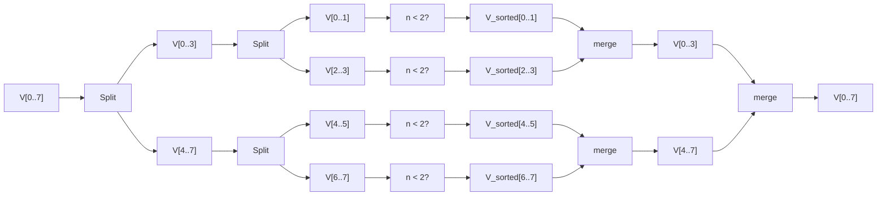
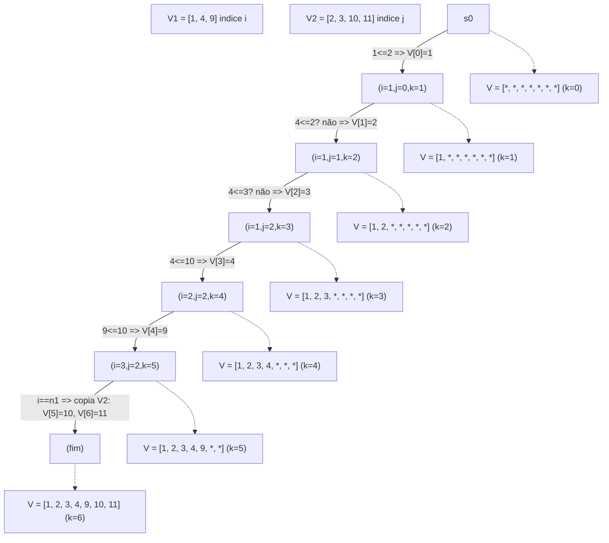
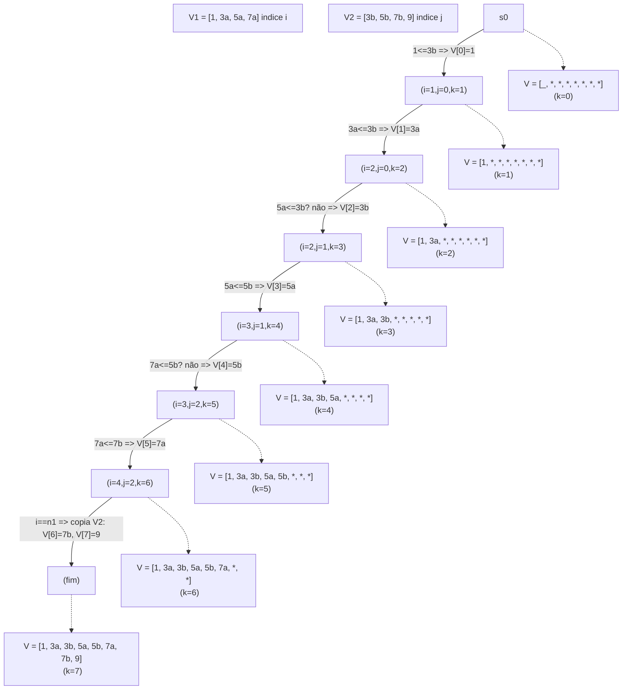

## Questão 3 — Merge Sort (resposta proposta)

### Ideia geral
O merge sort divide o vetor em duas metades, ordena recursivamente cada metade e intercala as duas metades ordenadas em um único vetor ordenado. O custo por nível é linear no tamanho do vetor (intercalação), e há aproximadamente log2(n) níveis de recursão.

### Diagrama Mermaid — Divisão e Merge (único, horizontal)


### Intercalação (merge) e estabilidade
Considere duas metades ordenadas `V1` e `V2`. Mantemos três índices: `i` (em `V1`), `j` (em `V2`) e `k` (posição de escrita em `V`). A cada passo escrevemos o menor entre `V1[i]` e `V2[j]` em `V[k]` e avançamos o(s) índice(s) correspondente(s). A condição `V1[i] <= V2[j]` garante estabilidade: em empates, o elemento da esquerda sai primeiro.

Trecho representativo:

```cpp
while (i < n1 && j < n2) {
    if (V1[i] <= V2[j]) { V[k++] = V1[i++]; }
    else { V[k++] = V2[j++]; }
}
// Copia o restante do lado não esgotado
```

### Passo a passo numérico Merge

#### Exemplo A — tamanho ímpar
Suponha `p=0, r=6, q=2`, com metades já ordenadas:

- `V1 = [1, 4, 9]` (n1=3), `V2 = [2, 3, 10, 11]` (n2=4)



#### Exemplo B — tamanho par
Suponha `p=0, r=7, q=3`:

- `V1 = [1, 3a, 5a, 7a]`, `V2 = [3b, 5b, 7b, 9]` (sufixos apenas para rastrear a origem)



### Complexidade
- Tempo por nível: Θ(n) (intercalação percorre todos os elementos das metades)
- Níveis da recursão: ≈ log₂(n)
- Resultado: `T(n) = Θ(n log n)` para melhor, médio e pior casos
- Espaço adicional: Θ(n) para os vetores temporários (ou Θ(n) no total, dependendo da implementação)

### Observações práticas e comparação breve com insertion sort
- Em vetores muito pequenos ou quase ordenados, o insertion sort costuma ser mais rápido devido a constantes menores e melhor localidade de referência.
- Para entradas aleatórias ou invertidas e tamanhos moderados/grandes, o merge sort domina por garantir `Θ(n log n)`.

### Paralelização do merge (breve)
O laço acima faz uma varredura sequencial (dependência de dados passo a passo). Para paralelizar, usa-se uma partição por diagonais (“merge path”): escolhe-se posições alvo `k` em `V` e encontra-se, por busca binária, pares `(i, j)` tais que `i + j = k` e `V1[i-1] <= V2[j]` e `V2[j-1] <= V1[i]`. Cada thread mescla um segmento independente. Isso mantém complexidade total `O(n)` com sobrecusto de `O(t log n)` para `t` partições, e é eficaz em GPUs/CPUs multinúcleo quando `n` é grande.

