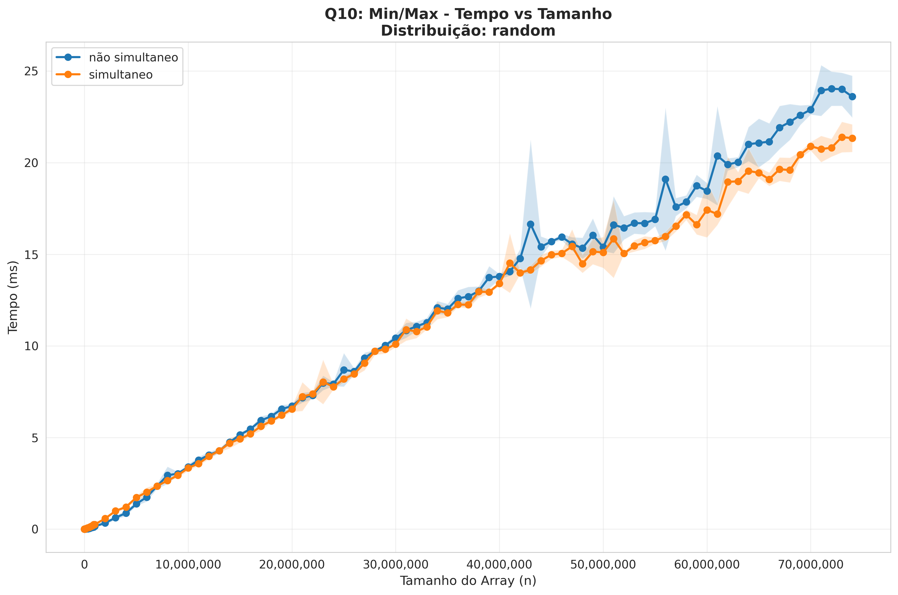
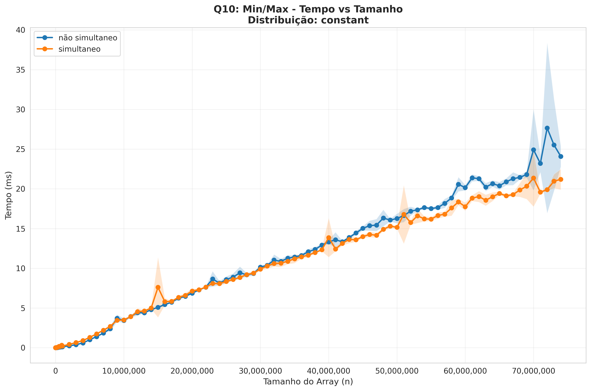
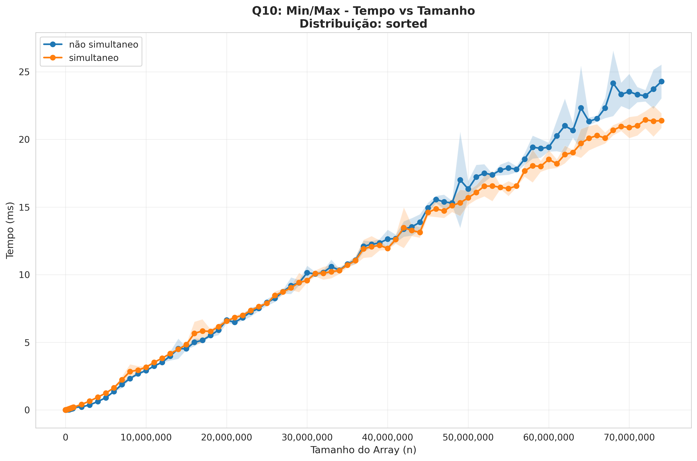
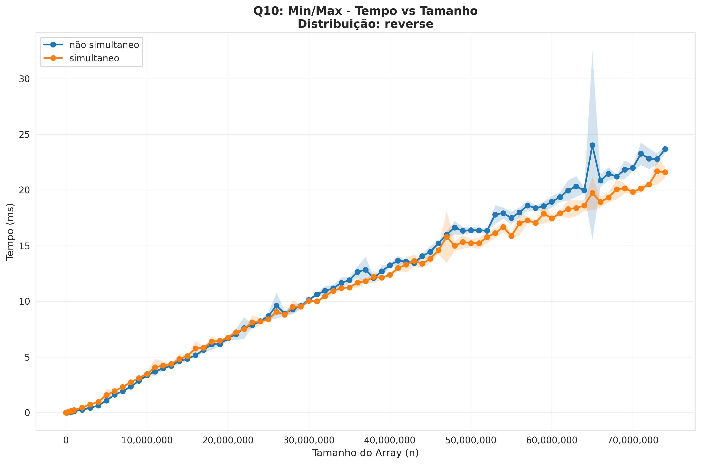
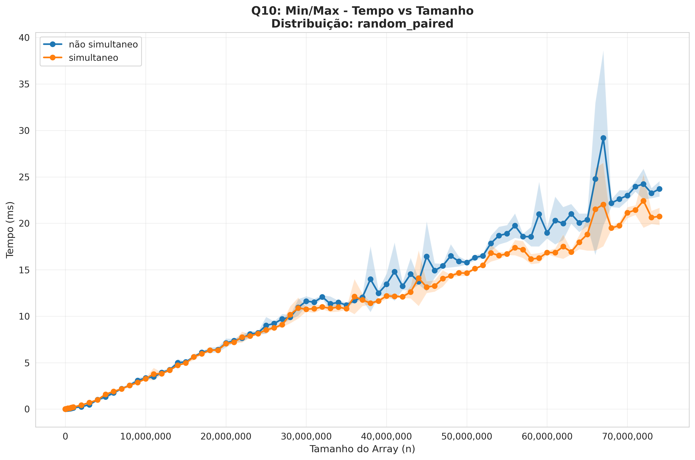
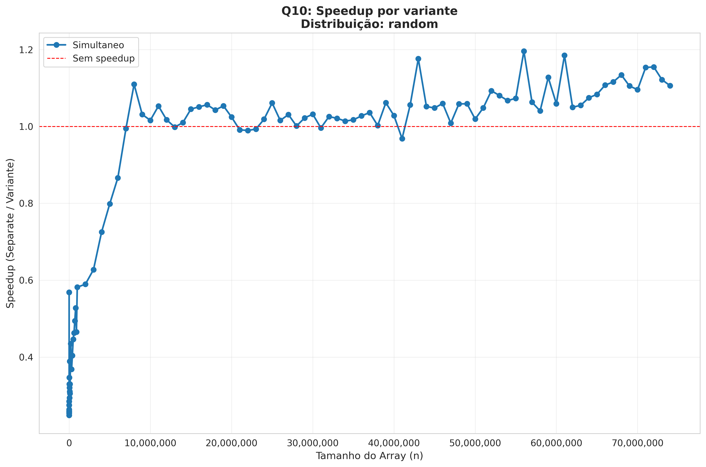

# Lista 4 - Questões de Mestrado

## Questão 10: Mínimo e Máximo Simultâneos

**Enunciado:** Implemente o algoritmo de mínimo e máximo simultâneos da seção 9.1 do livro do Cormen, 4ª Ed., na sua linguagem favorita e mostre através de medição de tempo que é mais rápido que a abordagem não-simultânea para um vetor de entrada suficientemente grande.

### Implementação

Foram implementadas duas abordagens em C++:

1. **Não-simultânea**: Duas passagens sequenciais pelo array (uma para min, outra para max)
   - Complexidade: `2(n-1)` comparações

2. **Simultânea**: Processamento em pares conforme descrito no Cormen
   - Complexidade: `≈ 3n/2` comparações

**Código:** `mestrado/questao_10_minmax/minmax.cpp`

### Análise de Comparações

A abordagem simultânea realiza menos comparações que a não-simultânea:

- **Não-simultânea**: `2(n-1)` comparações
- **Simultânea**: `3⌊n/2⌋` comparações

Para `n = 10.000.000`:
- Não-simultânea: `19.999.998` comparações
- Simultânea: `≈ 15.000.000` comparações (~25% de redução)

### Resultados de Benchmark

A diferença de desempenho no tempo de execução só se manifesta quando a flag de compilação `-funroll-loops` é ativada. Esta flag instrui o compilador a "desenrolar" loops simples, eliminando overhead de iteração e permitindo melhor paralelismo em nível de instrução e uso de registradores.

Os benchmarks foram executados com `g++ -O3 -march=native -funroll-loops`.

#### Entrada Aleatória (n = 2.050.000.000)

Para arrays suficientemente grandes, o ganho da abordagem simultânea se torna evidente:

| Algoritmo | Tempo médio (ms) | Desvio padrão (ms) |
|-----------|------------------|-------------------|
| Não-simultânea | 776.09 | 83.56 |
| Simultânea | 525.24 | 42.94 |

**Speedup**: **1.48x** (simultânea é ~48% mais rápida)

#### Observação sobre `-funroll-loops`

A flag `-funroll-loops` instrui o compilador a **duplicar o corpo de loops** (loop unrolling), reduzindo o overhead de controle (branches, incrementos, comparações) e aumentando paralelismo em nível de instrução.

**Exemplo**: Um loop com 100 iterações pode ser transformado em 25 iterações, cada uma processando 4 elementos de uma vez, reduzindo saltos e permitindo melhor pipelining e vetorização.

**Impacto no experimento**: Sem esta flag, o ganho da abordagem simultânea não foi encontrado, em termos de tempo de execução, com o caso não simultâneo sendo mais rápido até para entradas grandes, pois o overhead de processar elementos em pares supera a economia de comparações. Com `-funroll-loops`, o compilador otimiza ambos os loops, mas o loop simultâneo se beneficia mais devido ao menor número de comparações, traduzindo-se em ganho real de **~48% para arrays de 2 bilhões de elementos (7.45GB)**.

### Gráficos

Os gráficos abaixo mostram o comportamento dos algoritmos para diferentes distribuições de dados e tamanhos de entrada:


*Figura 1: Desempenho para dados aleatórios*


*Figura 2: Desempenho para dados constantes*


*Figura 3: Desempenho para dados ordenados*


*Figura 4: Desempenho para dados em ordem reversa*


*Figura 5: Desempenho para dados aleatórios pré-ordenados em pares*


*Figura 6: Speedup para dados aleatórios*

### Compilação e Execução

```bash
# Compilar
make benchmark_q10

# Executar benchmark
./bin/benchmark_q10 --max-size 100000000 --runs 5 --output-csv reports/q10_results.csv

# Gerar gráficos
python3 mestrado/common/plot_questoes.py reports/q10_results.csv
```

**Vítor Yeso Fidelis Freitas - Programa de Pós Graduação em Engenharia Elétrica e Computação - 2025.2**
