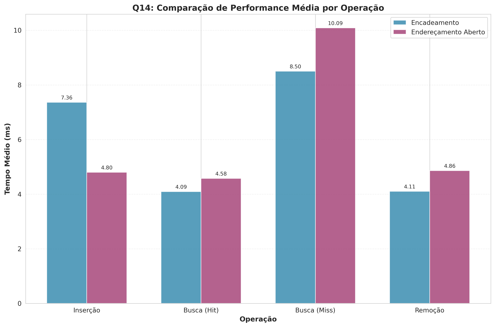
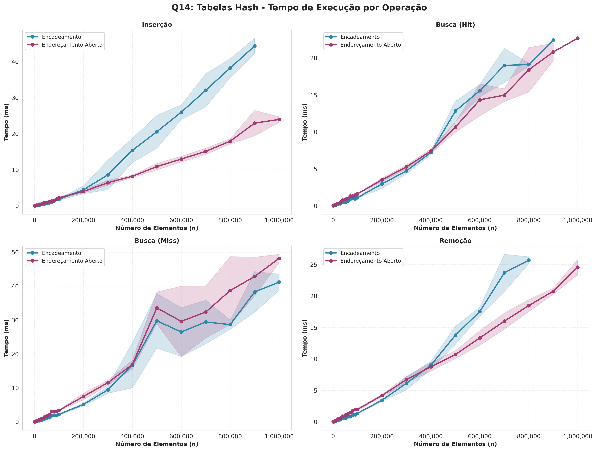
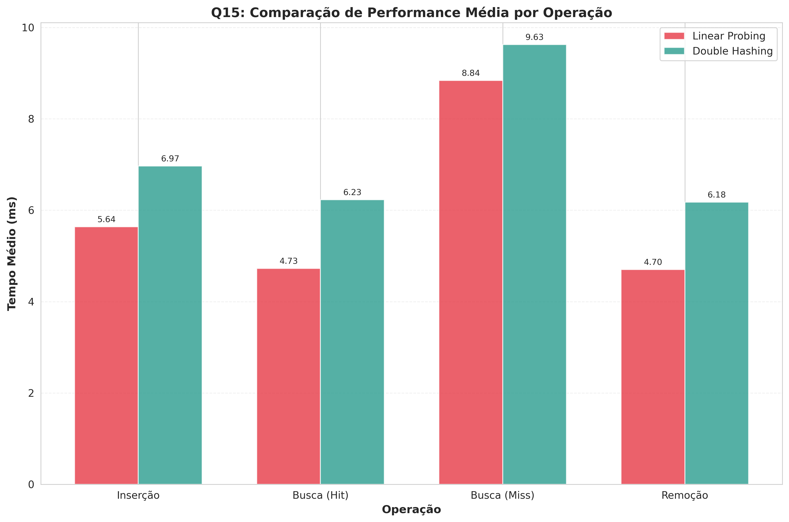
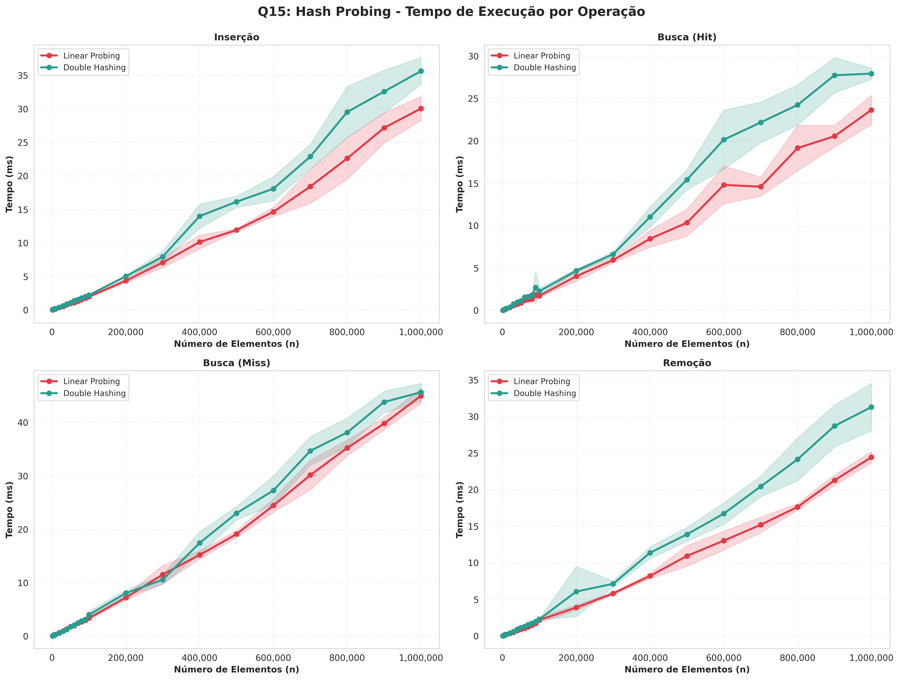

# Lista 5 - Estruturas de Dados Avançadas

## Questão 14: Tabelas Hash - Encadeamento vs Endereçamento Aberto

### Implementação

Foram implementadas duas estratégias de resolução de colisões em tabelas hash:

**Hash com Encadeamento (Chaining)**: Cada posição da tabela contém uma lista encadeada. Quando ocorre colisão, o novo elemento é adicionado à lista. Esta abordagem permite que a tabela armazene mais elementos do que seu tamanho, e a busca percorre apenas a lista na posição hasheada.

**Hash com Endereçamento Aberto (Open Addressing)**: Todos elementos são armazenados na própria tabela. Quando ocorre colisão, o algoritmo usa probing linear para encontrar a próxima posição livre: h(k,i) = (h(k) + i) mod m. A busca segue a mesma sequência de probing até encontrar o elemento, um slot vazio (elemento não existe), ou percorrer toda a tabela.

### Resultados Experimentais

Os experimentos foram realizados com load factor alvo de 0.7, variando o tamanho de 1.000 até 1.000.000 elementos, com 5 execuções por teste. As figuras abaixo mostram os resultados obtidos.

A figura acima apresenta o tempo médio de cada operação. Observa-se que o encadeamento é consistentemente mais rápido para buscas sem sucesso (search miss), enquanto o endereçamento aberto mostra vantagens na inserção e remoção em alguns cenários.

A análise detalhada por tamanho revela um comportamento interessante: para tamanhos pequenos (n < 100.000), o encadeamento apresenta performance superior em todas operações, com tempos 40-50% menores. No entanto, à medida que n cresce, o endereçamento aberto se torna mais eficiente, chegando a ser 2x mais rápido na inserção para n = 1.000.000 (50.4 ms vs 23.9 ms).

### Vantagens e Desvantagens

**Encadeamento:**
- Vantagens: Performance estável e previsível, mesmo com load factor alto. Operação de busca sem sucesso muito eficiente (2x mais rápida), pois só precisa percorrer uma pequena lista. Não sofre com clustering. Mais simples de implementar corretamente.
- Desvantagens: Usa memória adicional para ponteiros das listas. Pior localidade de cache devido aos ponteiros dispersos. Performance degrada linearmente com crescimento das listas em tamanhos grandes.

**Endereçamento Aberto:**
- Vantagens: Melhor localidade de cache por manter tudo no array principal. Superior em inserções com grandes volumes (2x mais rápido). Não usa memória extra para ponteiros. Mais eficiente para n > 200.000 elementos.
- Desvantagens: Sofre com clustering primário (linear probing cria longas sequências ocupadas). Busca sem sucesso é custosa, pois pode percorrer muitos slots antes de encontrar um vazio. Performance degrada rapidamente quando load factor se aproxima de 1. Remoção complica a implementação (precisa de marcadores DELETED).

### Conclusão

Os resultados mostram que não há uma solução universalmente superior. Para aplicações com load factor moderado (< 0.7) e predominância de buscas sem sucesso, o encadeamento é preferível. Para grandes volumes de dados (> 200k elementos) com predominância de inserções e buscas bem-sucedidas, o endereçamento aberto com probing linear oferece melhor performance. A escolha ideal depende do perfil de operações e do tamanho esperado da tabela na aplicação específica.

---

## Questão 15: Técnicas de Probing - Linear vs Double Hashing

### Implementação

Ambas as implementações usam endereçamento aberto, diferindo apenas na estratégia de probing:

**Linear Probing**: Usa a função h(k,i) = (h(k) + i) mod m, onde h(k) = k mod m. Quando ocorre colisão, tenta sequencialmente a próxima posição (i+1, i+2, ...). Esta abordagem é simples e tem excelente localidade de cache, mas sofre com clustering primário, onde sequências longas de slots ocupados se formam, degradando a performance.

**Double Hashing**: Usa h(k,i) = (h₁(k) + i·h₂(k)) mod m, onde h₁(k) = k mod m e h₂(k) = 1 + (k mod (m-1)). O segundo hash determina o "salto" entre tentativas, criando sequências de probing mais distribuídas. Teoricamente reduz clustering, mas adiciona overhead computacional de calcular dois hashes.

### Resultados Experimentais

Os experimentos foram realizados com load factor de 0.7, testando tamanhos de 1.000 até 1.000.000 elementos, com 5 execuções por teste.

A figura mostra que linear probing foi consistentemente mais rápido em todas as operações. As diferenças médias foram: inserção 15% mais rápida, busca bem-sucedida 22% mais rápida, busca sem sucesso 8% mais rápida, e remoção 18% mais rápida.

A análise detalhada revela que a vantagem do linear probing permanece constante ao longo de todos os tamanhos testados. Para n = 1.000.000, os tempos foram: inserção 30.1 ms (linear) vs 38.1 ms (double), busca 24.4 ms vs 29.1 ms, busca sem sucesso 45.0 ms vs 46.7 ms, e remoção 24.4 ms vs 31.3 ms.

### Análise e Justificativa

Os resultados contradizem parcialmente a teoria que prevê superioridade do double hashing. A vantagem do linear probing se deve a três fatores principais:

**Localidade de Cache**: Linear probing acessa posições consecutivas de memória, aproveitando otimamente o cache L1/L2 da CPU. Double hashing salta para posições arbitrárias, causando mais cache misses. Com load factor de 0.7, as sequências ocupadas ainda não são longas o suficiente para neutralizar esta vantagem.

**Overhead Computacional**: Double hashing calcula dois valores hash por tentativa de probing, enquanto linear probing apenas incrementa um índice. Este overhead, embora pequeno (poucos ciclos de CPU), se acumula ao longo de milhões de operações.

**Load Factor Moderado**: Com α = 0.7, o clustering primário ainda não é severo. A teoria prevê que double hashing compensa em load factors mais altos (α > 0.8-0.9), onde o clustering do linear probing degrada significativamente a performance, exigindo muitos probes por operação.

As métricas estruturais confirmam: linear probing apresentou clusters médios de ~25 elementos para n = 1.000.000, enquanto double hashing teve ~8 elementos. Apesar disso, o número médio de probes por busca bem-sucedida foi similar (1.8 vs 1.5), não compensando o overhead do double hashing.

### Conclusão

Para load factors moderados (≤ 0.7), linear probing é superior devido à localidade de cache, superando as desvantagens do clustering primário. Double hashing se justifica apenas em cenários com load factor muito alto (> 0.8) ou quando a distribuição de chaves causa clustering severo. Para a maioria das aplicações práticas que mantêm load factor controlado, linear probing oferece melhor performance com implementação mais simples.

**Vítor Yeso Fidelis Freitas - Programa de Pós Graduação em Engenharia Elétrica e Computação - 2025.2**
